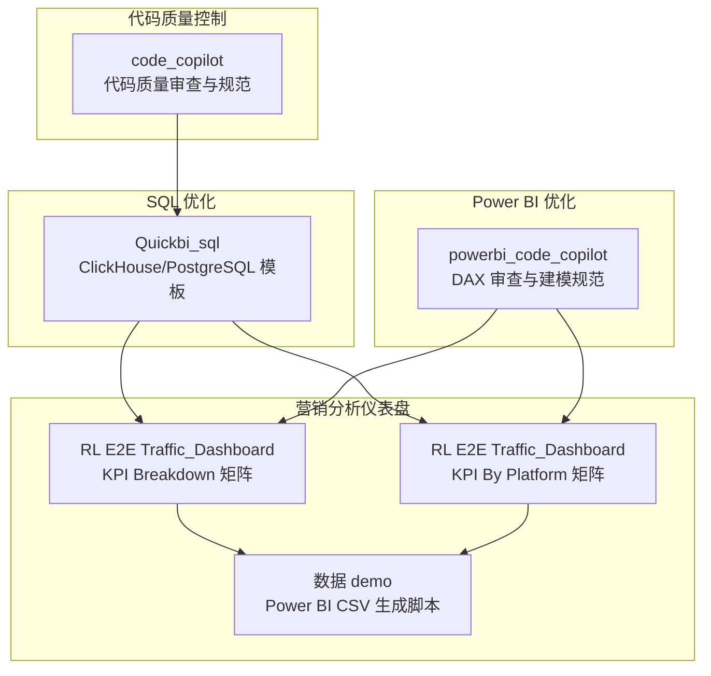
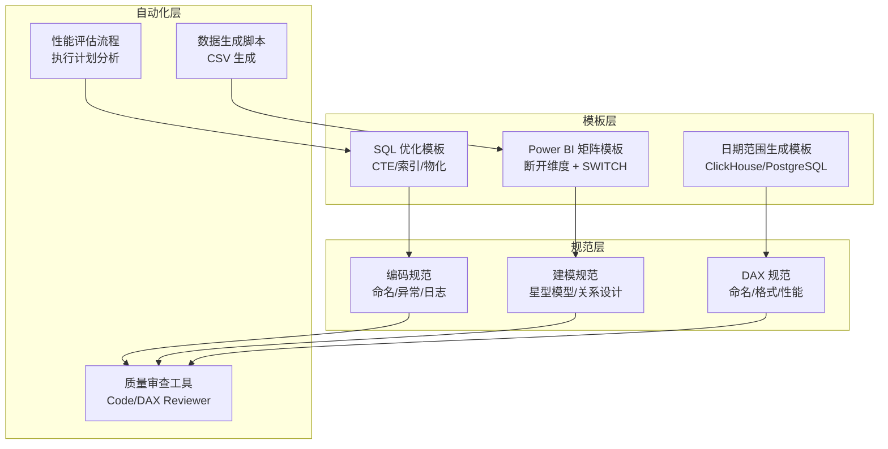
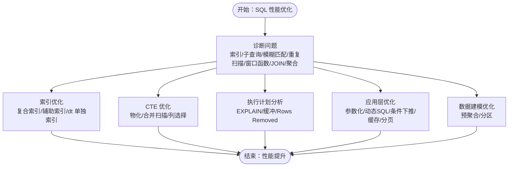
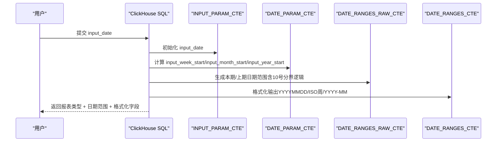
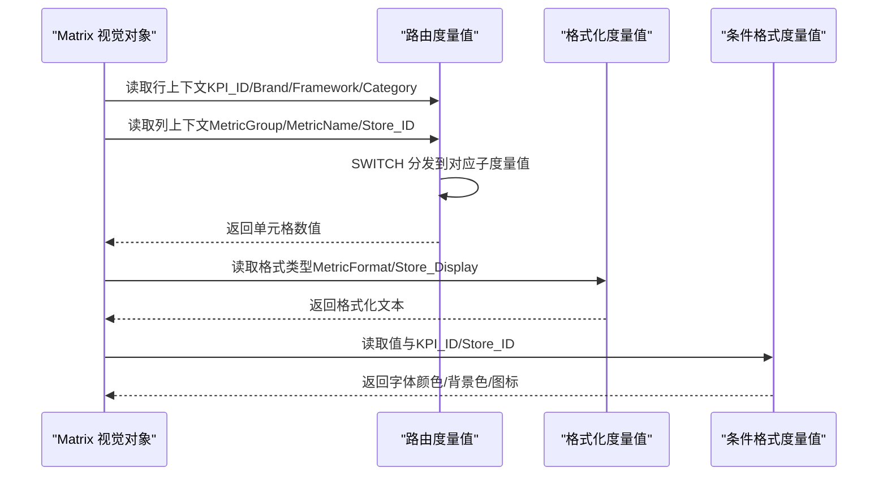
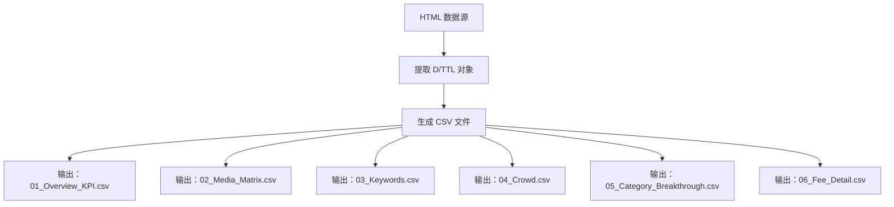
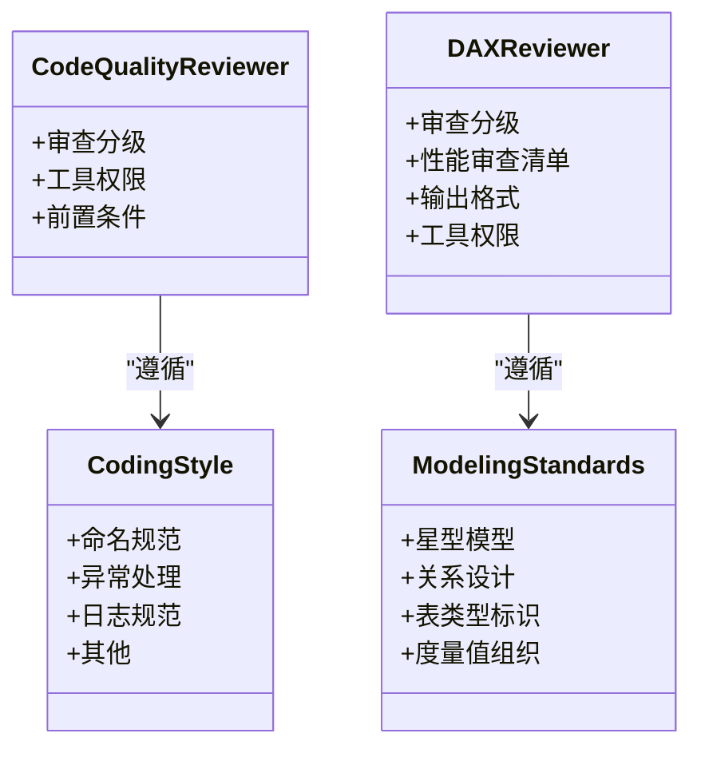
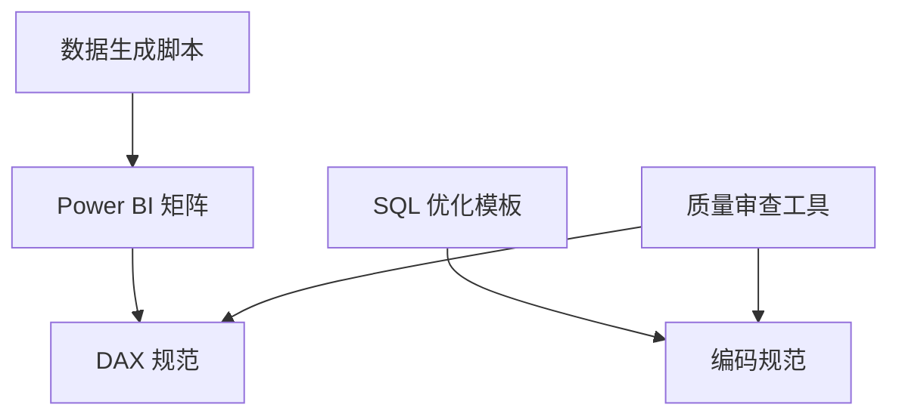

# 项目介绍

<cite>
**本文档引用的文件**
- [SQL_优化方案.md](file://Quickbi_sql/MAP/我的门店/SQL_优化方案.md)
- [weekly.sql](file://Quickbi_sql/周大福/周大福_日期范围生成_ARRAY JOIN_Clickhou/weekly.sql)
- [monthly.sql](file://Quickbi_sql/周大福/周大福_日期范围生成_ARRAY JOIN_Clickhou/monthly.sql)
- [monthly_cumulative_weekly_wiki.md](file://Quickbi_sql/周大福/周大福_日期范围生成_ARRAY JOIN_Clickhou/wiki/monthly_cumulative_weekly_wiki.md)
- [clickhouse_date_ranges.sql](file://Quickbi_sql/周大福/周大福_日期范围生成_demo/clickhouse_date_ranges.sql)
- [kpi_breakdown_matrix_solution.md](file://RL E2E/RL E2E Traffic_Dashboard/KPI Breakdown/kpi_breakdown_matrix_solution.md)
- [KPI By Platform_matrix_solution.md](file://RL E2E/RL E2E Traffic_Dashboard/KPI By Platform/KPI By Platform_matrix_solution.md)
- [generate_data.js](file://RL E2E/数据demo/powerbi_data/generate_data.js)
- [code-quality-reviewer.md](file://code_copilot/agents/code-quality-reviewer.md)
- [dax-reviewer.md](file://powerbi_code_copilot/agents/dax-reviewer.md)
- [coding-style.md](file://code_copilot/rules/coding-style.md)
- [dax-style.md](file://powerbi_code_copilot/rules/dax-style.md)
- [modeling-standards.md](file://powerbi_code_copilot/rules/modeling-standards.md)
- [domain-rules.md](file://code_copilot/rules/domain-rules.md)
</cite>

## 目录
1. [引言](#引言)
2. [项目结构](#项目结构)
3. [核心组件](#核心组件)
4. [架构总览](#架构总览)
5. [详细组件分析](#详细组件分析)
6. [依赖分析](#依赖分析)
7. [性能考量](#性能考量)
8. [故障排查指南](#故障排查指南)
9. [结论](#结论)
10. [附录](#附录)

## 引言
Qoder AI 是一个面向企业数据分析与商业智能的综合性平台，聚焦四大核心能力：SQL 性能优化、营销效果分析、代码质量控制、Power BI 优化。项目通过标准化的工具链与工程化实践，帮助数据分析师、开发者、数据工程师、项目经理等用户高效完成从数据准备、建模、可视化到质量保障的全流程任务。平台强调“可复用、可扩展、可治理”，在保证交付效率的同时，持续提升系统的稳定性与可维护性。

## 项目结构
项目采用按功能域划分的目录结构，围绕“SQL 优化”、“营销分析仪表盘”、“Power BI 优化”和“代码质量控制”四个主线展开：

- Quickbi_sql：ClickHouse/PostgreSQL 的 SQL 优化与日期范围生成模板，提供可复用的 CTE 结构与性能优化建议
- RL E2E：端到端营销流量分析仪表盘，包含 KPI Breakdown 矩阵与 KPI 按平台矩阵的完整实现方案
- powerbi_code_copilot：Power BI 模型与 DAX 的质量审查与建模规范
- code_copilot：通用代码质量审查与编码规范

**图表来源**
- [SQL_优化方案.md:1-822](file://Quickbi_sql/MAP/我的门店/SQL_优化方案.md#L1-L822)
- [kpi_breakdown_matrix_solution.md:1-939](file://RL E2E/RL E2E Traffic_Dashboard/KPI Breakdown/kpi_breakdown_matrix_solution.md#L1-L939)
- [KPI By Platform_matrix_solution.md:1-609](file://RL E2E/RL E2E Traffic_Dashboard/KPI By Platform/KPI By Platform_matrix_solution.md#L1-L609)
- [generate_data.js:1-438](file://RL E2E/数据demo/powerbi_data/generate_data.js#L1-L438)
- [dax-style.md:1-218](file://powerbi_code_copilot/rules/dax-style.md#L1-L218)
- [coding-style.md:1-34](file://code_copilot/rules/coding-style.md#L1-L34)

**章节来源**
- [SQL_优化方案.md:1-822](file://Quickbi_sql/MAP/我的门店/SQL_优化方案.md#L1-L822)
- [kpi_breakdown_matrix_solution.md:1-939](file://RL E2E/RL E2E Traffic_Dashboard/KPI Breakdown/kpi_breakdown_matrix_solution.md#L1-L939)
- [KPI By Platform_matrix_solution.md:1-609](file://RL E2E/RL E2E Traffic_Dashboard/KPI By Platform/KPI By Platform_matrix_solution.md#L1-L609)
- [generate_data.js:1-438](file://RL E2E/数据demo/powerbi_data/generate_data.js#L1-L438)
- [dax-style.md:1-218](file://powerbi_code_copilot/rules/dax-style.md#L1-L218)
- [coding-style.md:1-34](file://code_copilot/rules/coding-style.md#L1-L34)

## 核心组件
- SQL 性能优化引擎：提供 ClickHouse/PostgreSQL 的 SQL 结构优化、索引建议、CTE 物化控制与预聚合策略，显著降低查询延迟与资源消耗
- 营销分析仪表盘：内置 KPI Breakdown 矩阵与 KPI 按平台矩阵，支持断开维度 + SWITCH 路由的中国式报表实现，满足复杂层级与格式化需求
- Power BI 优化套件：提供 DAX 质量审查、建模规范与命名约定，确保模型可维护性与性能
- 代码质量控制：覆盖编码规范、异常处理、日志规范与安全规则，贯穿开发流程的质量保障

**章节来源**
- [SQL_优化方案.md:1-822](file://Quickbi_sql/MAP/我的门店/SQL_优化方案.md#L1-L822)
- [kpi_breakdown_matrix_solution.md:1-939](file://RL E2E/RL E2E Traffic_Dashboard/KPI Breakdown/kpi_breakdown_matrix_solution.md#L1-L939)
- [KPI By Platform_matrix_solution.md:1-609](file://RL E2E/RL E2E Traffic_Dashboard/KPI By Platform/KPI By Platform_matrix_solution.md#L1-L609)
- [dax-reviewer.md:1-56](file://powerbi_code_copilot/agents/dax-reviewer.md#L1-L56)
- [code-quality-reviewer.md:1-13](file://code_copilot/agents/code-quality-reviewer.md#L1-L13)
- [coding-style.md:1-34](file://code_copilot/rules/coding-style.md#L1-L34)
- [dax-style.md:1-218](file://powerbi_code_copilot/rules/dax-style.md#L1-L218)

## 架构总览
平台采用“模板 + 规范 + 自动化”的三层架构：
- 模板层：提供 SQL 与 Power BI 的可复用实现模板（如日期范围生成、矩阵报表）
- 规范层：制定编码与建模标准，确保一致性与可维护性
- 自动化层：通过脚本与审查工具，实现数据生成、质量检查与性能评估的自动化

**图表来源**
- [SQL_优化方案.md:1-822](file://Quickbi_sql/MAP/我的门店/SQL_优化方案.md#L1-L822)
- [monthly_cumulative_weekly_wiki.md:1-595](file://Quickbi_sql/周大福/周大福_日期范围生成_ARRAY JOIN_Clickhou/wiki/monthly_cumulative_weekly_wiki.md#L1-L595)
- [kpi_breakdown_matrix_solution.md:1-939](file://RL E2E/RL E2E Traffic_Dashboard/KPI Breakdown/kpi_breakdown_matrix_solution.md#L1-L939)
- [KPI By Platform_matrix_solution.md:1-609](file://RL E2E/RL E2E Traffic_Dashboard/KPI By Platform/KPI By Platform_matrix_solution.md#L1-L609)
- [coding-style.md:1-34](file://code_copilot/rules/coding-style.md#L1-L34)
- [modeling-standards.md:1-88](file://powerbi_code_copilot/rules/modeling-standards.md#L1-L88)
- [dax-style.md:1-218](file://powerbi_code_copilot/rules/dax-style.md#L1-L218)
- [generate_data.js:1-438](file://RL E2E/数据demo/powerbi_data/generate_data.js#L1-L438)

## 详细组件分析

### SQL 性能优化组件
- 问题诊断：识别索引失效、子查询重复扫描、模糊匹配、重复扫描、窗口函数冗余、JOIN 不必要、聚合重复计算等问题
- 优化策略：索引重建、CTE 物化、消除类型转换、合并扫描、动态排序、LEFT JOIN 替代、UNION ALL 合并、列选择优化
- 应用层建议：参数化查询、动态 SQL、条件下推、结果缓存、分页优化
- 数据建模建议：预聚合表、分区表

**图表来源**
- [SQL_优化方案.md:1-822](file://Quickbi_sql/MAP/我的门店/SQL_优化方案.md#L1-L822)

**章节来源**
- [SQL_优化方案.md:1-822](file://Quickbi_sql/MAP/我的门店/SQL_优化方案.md#L1-L822)

### 日期范围生成组件（ClickHouse）
- 多报表类型：周报、月累计周报、月报、年累计月报
- 核心逻辑：输入日期 → 日期锚点（周/月/年）→ 原始日期范围（本期/上期）→ 格式化字段 → ARRAY JOIN 列转行
- 优化要点：10 号分界逻辑、ISO 周处理、类型安全（INTERVAL 1 DAY 替代裸整数）

**图表来源**
- [weekly.sql:1-117](file://Quickbi_sql/周大福/周大福_日期范围生成_ARRAY JOIN_Clickhou/weekly.sql#L1-L117)
- [monthly.sql:1-109](file://Quickbi_sql/周大福/周大福_日期范围生成_ARRAY JOIN_Clickhou/monthly.sql#L1-L109)
- [monthly_cumulative_weekly_wiki.md:1-595](file://Quickbi_sql/周大福/周大福_日期范围生成_ARRAY JOIN_Clickhou/wiki/monthly_cumulative_weekly_wiki.md#L1-L595)
- [clickhouse_date_ranges.sql:1-214](file://Quickbi_sql/周大福/周大福_日期范围生成_demo/clickhouse_date_ranges.sql#L1-L214)

**章节来源**
- [weekly.sql:1-117](file://Quickbi_sql/周大福/周大福_日期范围生成_ARRAY JOIN_Clickhou/weekly.sql#L1-L117)
- [monthly.sql:1-109](file://Quickbi_sql/周大福/周大福_日期范围生成_ARRAY JOIN_Clickhou/monthly.sql#L1-L109)
- [monthly_cumulative_weekly_wiki.md:1-595](file://Quickbi_sql/周大福/周大福_日期范围生成_ARRAY JOIN_Clickhou/wiki/monthly_cumulative_weekly_wiki.md#L1-L595)
- [clickhouse_date_ranges.sql:1-214](file://Quickbi_sql/周大福/周大福_日期范围生成_demo/clickhouse_date_ranges.sql#L1-L214)

### Power BI KPI 矩阵组件
- KPI Breakdown 矩阵：3 级行（Brand > Framework > Category）+ 2 级列（MetricGroup > MetricName），通过断开维度 + SWITCH 路由实现中国式报表
- KPI By Platform 矩阵：行（自定义 KPI）+ 列（店铺），支持格式化显示与条件格式
- 核心实现：断开维度表 + SWITCH 动态路由 + 格式化度量值 + 条件格式

**图表来源**
- [kpi_breakdown_matrix_solution.md:1-939](file://RL E2E/RL E2E Traffic_Dashboard/KPI Breakdown/kpi_breakdown_matrix_solution.md#L1-L939)
- [KPI By Platform_matrix_solution.md:1-609](file://RL E2E/RL E2E Traffic_Dashboard/KPI By Platform/KPI By Platform_matrix_solution.md#L1-L609)
- [dax-style.md:1-218](file://powerbi_code_copilot/rules/dax-style.md#L1-L218)

**章节来源**
- [kpi_breakdown_matrix_solution.md:1-939](file://RL E2E/RL E2E Traffic_Dashboard/KPI Breakdown/kpi_breakdown_matrix_solution.md#L1-L939)
- [KPI By Platform_matrix_solution.md:1-609](file://RL E2E/RL E2E Traffic_Dashboard/KPI By Platform/KPI By Platform_matrix_solution.md#L1-L609)
- [dax-style.md:1-218](file://powerbi_code_copilot/rules/dax-style.md#L1-L218)

### 数据生成与演示组件
- generate_data.js：从 HTML 提取数据对象，生成 Power BI 所需的 CSV 文件（Overview、Media、Keywords、Crowd、Category、Fee）
- 用途：为仪表盘提供标准化演示数据，便于快速验证与演示

**图表来源**
- [generate_data.js:1-438](file://RL E2E/数据demo/powerbi_data/generate_data.js#L1-L438)

**章节来源**
- [generate_data.js:1-438](file://RL E2E/数据demo/powerbi_data/generate_data.js#L1-L438)

### 代码质量控制组件
- Code Quality Reviewer：审查代码质量、安全性与可维护性，前置条件为规范审查通过
- DAX Quality Reviewer：审查 DAX 的正确性、性能与可维护性，提供性能评估清单
- 编码规范：命名、异常处理、日志、魔法值等
- 建模规范：星型模型、关系设计、表类型标识、度量值组织

**图表来源**
- [code-quality-reviewer.md:1-13](file://code_copilot/agents/code-quality-reviewer.md#L1-L13)
- [dax-reviewer.md:1-56](file://powerbi_code_copilot/agents/dax-reviewer.md#L1-L56)
- [coding-style.md:1-34](file://code_copilot/rules/coding-style.md#L1-L34)
- [modeling-standards.md:1-88](file://powerbi_code_copilot/rules/modeling-standards.md#L1-L88)

**章节来源**
- [code-quality-reviewer.md:1-13](file://code_copilot/agents/code-quality-reviewer.md#L1-L13)
- [dax-reviewer.md:1-56](file://powerbi_code_copilot/agents/dax-reviewer.md#L1-L56)
- [coding-style.md:1-34](file://code_copilot/rules/coding-style.md#L1-L34)
- [modeling-standards.md:1-88](file://powerbi_code_copilot/rules/modeling-standards.md#L1-L88)

## 依赖分析
- 组件耦合：SQL 优化模板与建模规范强相关；Power BI 矩阵依赖 DAX 规范；数据生成脚本服务于仪表盘演示
- 外部依赖：ClickHouse/PostgreSQL 数据库、Power BI Desktop、JScript（CSV 生成）
- 规范驱动：编码规范与建模规范贯穿开发流程，审查工具作为质量门禁

**图表来源**
- [coding-style.md:1-34](file://code_copilot/rules/coding-style.md#L1-L34)
- [dax-style.md:1-218](file://powerbi_code_copilot/rules/dax-style.md#L1-L218)
- [generate_data.js:1-438](file://RL E2E/数据demo/powerbi_data/generate_data.js#L1-L438)

**章节来源**
- [coding-style.md:1-34](file://code_copilot/rules/coding-style.md#L1-L34)
- [dax-style.md:1-218](file://powerbi_code_copilot/rules/dax-style.md#L1-L218)
- [generate_data.js:1-438](file://RL E2E/数据demo/powerbi_data/generate_data.js#L1-L438)

## 性能考量
- SQL 层面：通过索引优化、CTE 物化、消除类型转换与重复扫描，显著降低查询成本
- Power BI 层面：断开维度 + SWITCH 路由减少不必要的筛选传播，格式化与条件格式在度量值层面实现，避免复杂视觉对象带来的性能损耗
- 自动化层面：执行计划分析与预聚合策略，结合分区表与缓存机制，提升整体响应速度

[本节为通用指导，无需引用具体文件]

## 故障排查指南
- SQL 问题定位：使用 EXPLAIN 分析执行计划，关注全表扫描、排序策略、JOIN 类型与 CTE 物化情况
- Power BI 问题定位：检查断开维度是否正确、SWITCH 路由键是否匹配、格式化度量值是否返回空值
- 质量问题定位：依据审查分级与清单逐项核对，优先处理阻塞性问题

**章节来源**
- [SQL_优化方案.md:701-717](file://Quickbi_sql/MAP/我的门店/SQL_优化方案.md#L701-L717)
- [dax-reviewer.md:1-56](file://powerbi_code_copilot/agents/dax-reviewer.md#L1-L56)
- [code-quality-reviewer.md:1-13](file://code_copilot/agents/code-quality-reviewer.md#L1-L13)

## 结论
Qoder AI 通过标准化模板、严格规范与自动化工具，构建了覆盖 SQL 性能优化、营销分析仪表盘、Power BI 优化与代码质量控制的完整能力体系。平台既适合初学者快速上手，也为资深用户提供深度定制与优化空间，是企业数据分析与商业智能落地的理想选择。

[本节为总结性内容，无需引用具体文件]

## 附录
- 目标用户群体：数据分析师、开发者、数据工程师、项目经理
- 核心价值主张：提升 SQL 查询性能、简化营销分析仪表盘构建、强化代码与模型质量、提供可复用模板与规范
- 发展历程与创新：以模板化与规范化为核心，持续沉淀最佳实践，推动团队协作与交付效率提升

[本节为概述性内容，无需引用具体文件]