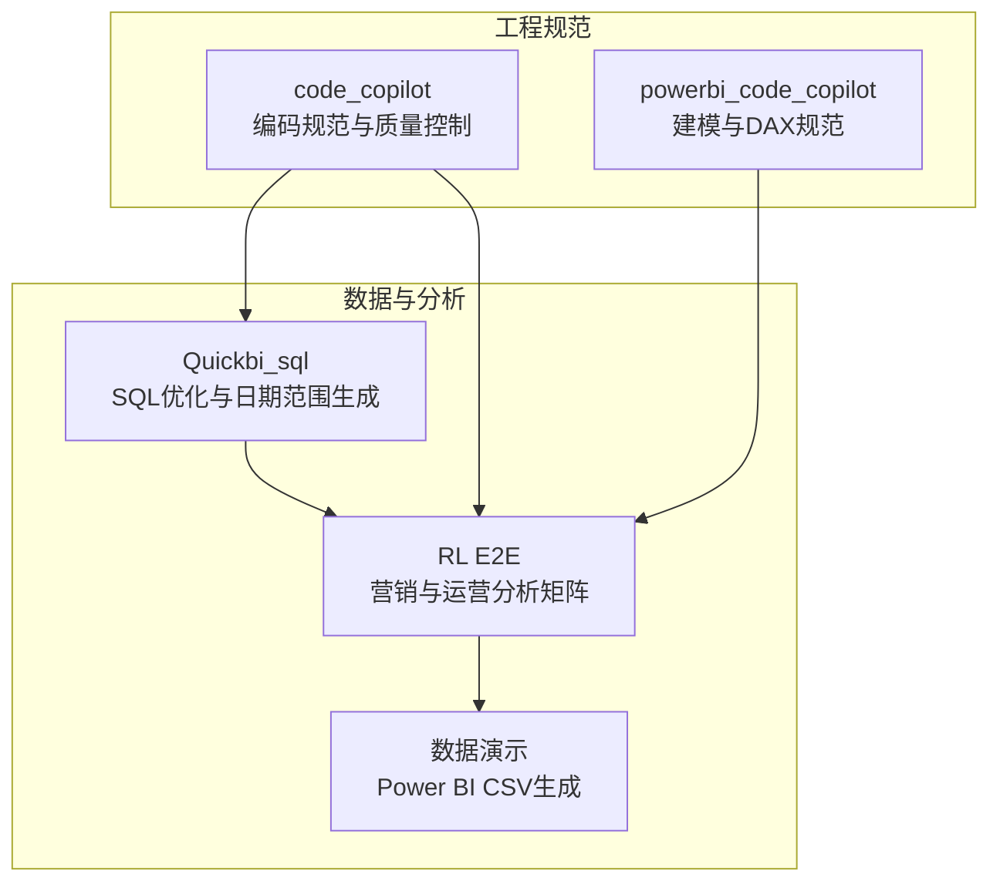
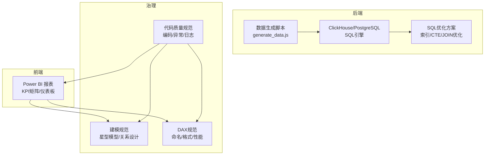
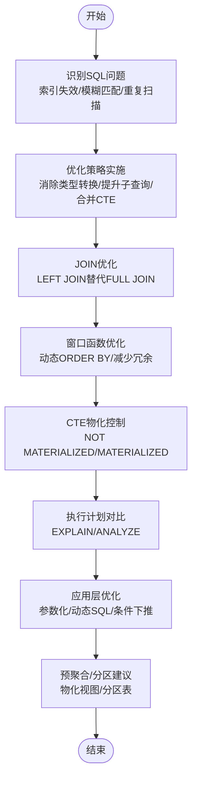
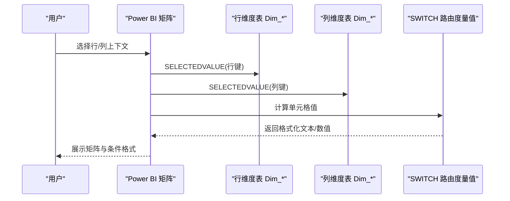
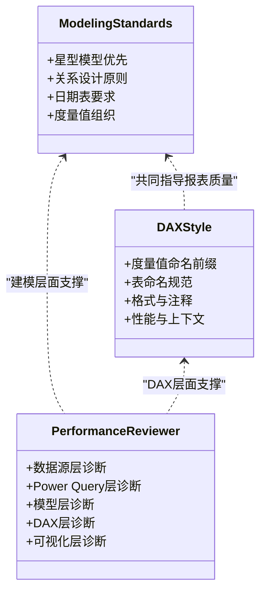
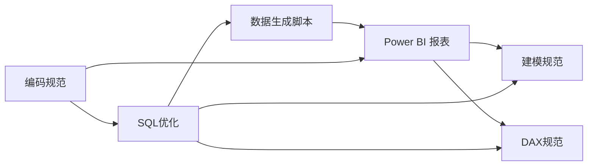

# 项目概述

<cite>
**本文档引用的文件**
- [SQL_优化方案.md](file://Quickbi_sql/MAP/我的门店/SQL_优化方案.md)
- [weekly.sql](file://Quickbi_sql/周大福/周大福_日期范围生成_ARRAY JOIN_Clickhou/weekly.sql)
- [monthly_cumulative_weekly.sql](file://Quickbi_sql/周大福/周大福_日期范围生成_ARRAY JOIN_Clickhou/monthly_cumulative_weekly.sql)
- [clickhouse_date_ranges.sql](file://Quickbi_sql/周大福/周大福_日期范围生成_demo/clickhouse_date_ranges.sql)
- [generate_data.js](file://RL E2E/数据demo/powerbi_data/generate_data.js)
- [kpi_breakdown_matrix_solution.md](file://RL E2E/RL E2E Traffic_Dashboard/KPI Breakdown/kpi_breakdown_matrix_solution.md)
- [KPI By Platform_matrix_solution.md](file://RL E2E/RL E2E Traffic_Dashboard/KPI By Platform/KPI By Platform_matrix_solution.md)
- [modeling-standards.md](file://powerbi_code_copilot/rules/modeling-standards.md)
- [dax-style.md](file://powerbi_code_copilot/rules/dax-style.md)
- [performance-reviewer.md](file://powerbi_code_copilot/agents/performance-reviewer.md)
- [dax-reviewer.md](file://powerbi_code_copilot/agents/dax-reviewer.md)
- [coding-style.md](file://code_copilot/rules/coding-style.md)
- [domain-rules.md](file://code_copilot/rules/domain-rules.md)
</cite>

## 目录
1. [简介](#简介)
2. [项目结构](#项目结构)
3. [核心组件](#核心组件)
4. [架构总览](#架构总览)
5. [详细组件分析](#详细组件分析)
6. [依赖分析](#依赖分析)
7. [性能考量](#性能考量)
8. [故障排查指南](#故障排查指南)
9. [结论](#结论)
10. [附录](#附录)

## 简介
本项目围绕“Qoder AI 前端与后端 Web”展开，聚焦四大核心能力：SQL 性能优化、营销效果分析、代码质量控制、Power BI 优化。项目通过标准化的数据建模、严谨的 DAX 编写规范、自动化数据生成工具与可复用的报表矩阵模板，形成从前端可视化到后端数据引擎的闭环。目标是帮助业务与技术团队高效产出高质量的分析报表与数据洞察，降低维护成本并提升性能与稳定性。

## 项目结构
项目采用按功能域划分的目录结构，四大模块分别承载不同职责：
- Quickbi_sql：ClickHouse/PostgreSQL SQL 优化与日期范围生成，支撑门店与运营分析
- RL E2E：营销流量与运营分析的 Power BI 报表矩阵方案与数据演示
- code_copilot：通用代码质量与安全规范，保障工程化质量
- powerbi_code_copilot：Power BI 建模与 DAX 审查规范，确保模型与度量值的可维护性与性能

图表来源
- [SQL_优化方案.md](file://Quickbi_sql/MAP/我的门店/SQL_优化方案.md)
- [kpi_breakdown_matrix_solution.md](file://RL E2E/RL E2E Traffic_Dashboard/KPI Breakdown/kpi_breakdown_matrix_solution.md)
- [KPI By Platform_matrix_solution.md](file://RL E2E/RL E2E Traffic_Dashboard/KPI By Platform/KPI By Platform_matrix_solution.md)
- [generate_data.js](file://RL E2E/数据demo/powerbi_data/generate_data.js)
- [modeling-standards.md](file://powerbi_code_copilot/rules/modeling-standards.md)
- [dax-style.md](file://powerbi_code_copilot/rules/dax-style.md)

章节来源
- [SQL_优化方案.md](file://Quickbi_sql/MAP/我的门店/SQL_优化方案.md)
- [kpi_breakdown_matrix_solution.md](file://RL E2E/RL E2E Traffic_Dashboard/KPI Breakdown/kpi_breakdown_matrix_solution.md)
- [KPI By Platform_matrix_solution.md](file://RL E2E/RL E2E Traffic_Dashboard/KPI By Platform/KPI By Platform_matrix_solution.md)
- [generate_data.js](file://RL E2E/数据demo/powerbi_data/generate_data.js)
- [modeling-standards.md](file://powerbi_code_copilot/rules/modeling-standards.md)
- [dax-style.md](file://powerbi_code_copilot/rules/dax-style.md)

## 核心组件
- SQL 性能优化引擎
  - 针对 ClickHouse/PostgreSQL 的索引、CTE 物化、JOIN 优化与窗口函数优化
  - 提供可落地的执行计划对比与预聚合/分区建议
- 营销效果分析平台
  - 基于 Power BI 的“中国式报表”矩阵：KPI Breakdown 与 KPI By Platform
  - 通过断开维度 + SWITCH 路由实现灵活、可扩展的行列矩阵
- 代码质量控制体系
  - 编码规范、异常与日志规范、幂等等工程实践
- Power BI 优化与治理
  - 星型模型优先、关系设计、度量值组织与性能审查流程

章节来源
- [SQL_优化方案.md](file://Quickbi_sql/MAP/我的门店/SQL_优化方案.md)
- [kpi_breakdown_matrix_solution.md](file://RL E2E/RL E2E Traffic_Dashboard/KPI Breakdown/kpi_breakdown_matrix_solution.md)
- [KPI By Platform_matrix_solution.md](file://RL E2E/RL E2E Traffic_Dashboard/KPI By Platform/KPI By Platform_matrix_solution.md)
- [coding-style.md](file://code_copilot/rules/coding-style.md)
- [modeling-standards.md](file://powerbi_code_copilot/rules/modeling-standards.md)
- [dax-style.md](file://powerbi_code_copilot/rules/dax-style.md)

## 架构总览
项目整体采用“数据生成 → 建模治理 → 报表矩阵 → 性能优化”的流水线式架构。前端通过 Power BI 可视化呈现，后端通过 SQL 引擎与数据生成脚本提供稳定的数据源。

图表来源
- [generate_data.js](file://RL E2E/数据demo/powerbi_data/generate_data.js)
- [SQL_优化方案.md](file://Quickbi_sql/MAP/我的门店/SQL_优化方案.md)
- [modeling-standards.md](file://powerbi_code_copilot/rules/modeling-standards.md)
- [dax-style.md](file://powerbi_code_copilot/rules/dax-style.md)
- [coding-style.md](file://code_copilot/rules/coding-style.md)

## 详细组件分析

### SQL 性能优化模块
- 问题识别与优化策略
  - 索引失效、子查询重复扫描、模糊匹配、重复扫描、窗口函数冗余、JOIN 不必要、聚合重复计算等
  - 通过消除类型转换、提升 MAX(dt) 子查询、合并 CTE、动态 ORDER BY、LEFT JOIN 替代 FULL JOIN 等手段优化
- CTE 物化与预聚合
  - 使用 PostgreSQL CTE 物化提示控制重复计算
  - 建议创建预聚合表与分区表，降低扫描成本
- 执行计划与应用层优化
  - 对比 EXPLAIN/ANALYZE，关注 Seq Scan、Sort、Hash Join、CTE Scan 等指标
  - 参数化查询、动态 SQL 拼接、条件下推、结果缓存、分页优化

图表来源
- [SQL_优化方案.md](file://Quickbi_sql/MAP/我的门店/SQL_优化方案.md)

章节来源
- [SQL_优化方案.md](file://Quickbi_sql/MAP/我的门店/SQL_优化方案.md)

### 营销效果分析模块（Power BI）
- KPI Breakdown 矩阵
  - 双维度断开 + 列头 SWITCH 分发 + ISINSCOPE 层级检测
  - 支持 Total 行、参差层级、格式化显示与条件格式
- KPI By Platform 矩阵
  - 断开维度 + SWITCH 动态路由，按 KPI 与店铺组合生成 17×5 网格
  - 支持自定义排序、格式化显示与条件格式

图表来源
- [kpi_breakdown_matrix_solution.md](file://RL E2E/RL E2E Traffic_Dashboard/KPI Breakdown/kpi_breakdown_matrix_solution.md)
- [KPI By Platform_matrix_solution.md](file://RL E2E/RL E2E Traffic_Dashboard/KPI By Platform/KPI By Platform_matrix_solution.md)

章节来源
- [kpi_breakdown_matrix_solution.md](file://RL E2E/RL E2E Traffic_Dashboard/KPI Breakdown/kpi_breakdown_matrix_solution.md)
- [KPI By Platform_matrix_solution.md](file://RL E2E/RL E2E Traffic_Dashboard/KPI By Platform/KPI By Platform_matrix_solution.md)

### 代码质量控制模块
- 编码规范
  - 命名风格、异常处理、日志规范、幂等与并发策略
- 领域规则
  - 金额单位、时间字段、外部接口超时与降级、状态机约束

章节来源
- [coding-style.md](file://code_copilot/rules/coding-style.md)
- [domain-rules.md](file://code_copilot/rules/domain-rules.md)

### Power BI 优化与治理模块
- 建模规范
  - 星型模型优先、关系设计、日期表要求、度量值组织与禁用事项
- DAX 规范
  - 命名约定、格式规范、编写原则与禁止事项
- 性能审查
  - 数据源层、Power Query 层、模型层、DAX 层与可视化层的诊断框架

图表来源
- [modeling-standards.md](file://powerbi_code_copilot/rules/modeling-standards.md)
- [dax-style.md](file://powerbi_code_copilot/rules/dax-style.md)
- [performance-reviewer.md](file://powerbi_code_copilot/agents/performance-reviewer.md)

章节来源
- [modeling-standards.md](file://powerbi_code_copilot/rules/modeling-standards.md)
- [dax-style.md](file://powerbi_code_copilot/rules/dax-style.md)
- [performance-reviewer.md](file://powerbi_code_copilot/agents/performance-reviewer.md)
- [dax-reviewer.md](file://powerbi_code_copilot/agents/dax-reviewer.md)

## 依赖分析
- 组件耦合与协作
  - SQL 优化为 Power BI 提供高质量数据源，二者通过数据生成脚本衔接
  - 建模与 DAX 规范为报表矩阵提供统一的模型与度量值标准
  - 代码质量规范贯穿前后端，确保工程化与可维护性
- 外部依赖与集成点
  - Power BI 与 ClickHouse/PostgreSQL 的查询折叠与关系传播
  - JavaScript 脚本生成 CSV 数据，驱动报表数据源

图表来源
- [generate_data.js](file://RL E2E/数据demo/powerbi_data/generate_data.js)
- [SQL_优化方案.md](file://Quickbi_sql/MAP/我的门店/SQL_优化方案.md)
- [modeling-standards.md](file://powerbi_code_copilot/rules/modeling-standards.md)
- [dax-style.md](file://powerbi_code_copilot/rules/dax-style.md)
- [coding-style.md](file://code_copilot/rules/coding-style.md)

章节来源
- [generate_data.js](file://RL E2E/数据demo/powerbi_data/generate_data.js)
- [SQL_优化方案.md](file://Quickbi_sql/MAP/我的门店/SQL_优化方案.md)
- [modeling-standards.md](file://powerbi_code_copilot/rules/modeling-standards.md)
- [dax-style.md](file://powerbi_code_copilot/rules/dax-style.md)
- [coding-style.md](file://code_copilot/rules/coding-style.md)

## 性能考量
- SQL 层
  - 通过索引优化、CTE 物化、JOIN 改写与窗口函数优化显著降低扫描与计算开销
  - 建议引入预聚合与分区，配合应用层参数化与动态 SQL，进一步提升响应速度
- Power BI 层
  - 星型模型与清晰的关系设计减少循环依赖与不必要的筛选传播
  - 使用断开维度 + SWITCH 路由，避免复杂上下文转换与重复计算
  - 通过性能审查清单逐项优化数据源、查询折叠、度量值复杂度与可视化开销

## 故障排查指南
- SQL 问题定位
  - 使用 EXPLAIN/ANALYZE 对比优化前后执行计划，关注全表扫描、排序策略与 CTE 行为
  - 检查索引是否命中、是否存在不必要的类型转换与 LIKE 前导通配符
- Power BI 问题定位
  - 性能审查：从数据源层、Power Query 层、模型层、DAX 层到可视化层逐层排查
  - 建模问题：确认关系方向、日期表标记、未使用表/列清理与多对多关系处理
  - DAX 问题：检查上下文转换、迭代函数规模、变量复用与时间智能函数使用

章节来源
- [SQL_优化方案.md](file://Quickbi_sql/MAP/我的门店/SQL_优化方案.md)
- [performance-reviewer.md](file://powerbi_code_copilot/agents/performance-reviewer.md)
- [dax-reviewer.md](file://powerbi_code_copilot/agents/dax-reviewer.md)

## 结论
本项目通过“SQL 性能优化 + 营销效果分析 + 代码质量控制 + Power BI 优化”的协同，构建了从数据生成、建模治理到报表呈现的完整闭环。四大模块既相对独立又紧密协作，既能满足初学者快速上手，也能为有经验的开发者提供深入的技术细节与最佳实践参考。建议在实际落地中结合业务场景持续迭代，逐步完善预聚合与分区策略，强化度量值的可维护性与性能表现。

## 附录
- 应用场景
  - 门店销售与库存分析、营销活动效果追踪、跨平台 KPI 对比与趋势分析
- 目标用户
  - 数据分析师、BI 工程师、产品经理与运营人员
- 技术选型理由
  - ClickHouse/PostgreSQL：高性能 OLAP 与 SQL 生态成熟
  - Power BI：丰富的可视化能力与强大的 DAX 表达式生态
  - 规范先行：通过建模与 DAX 规范降低长期维护成本