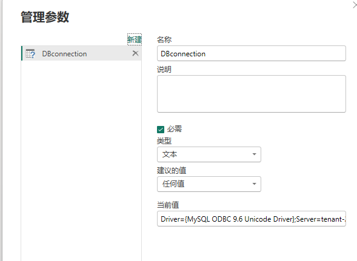
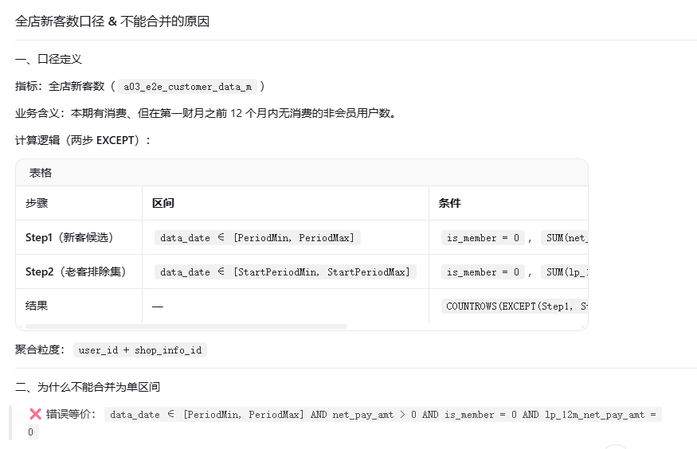
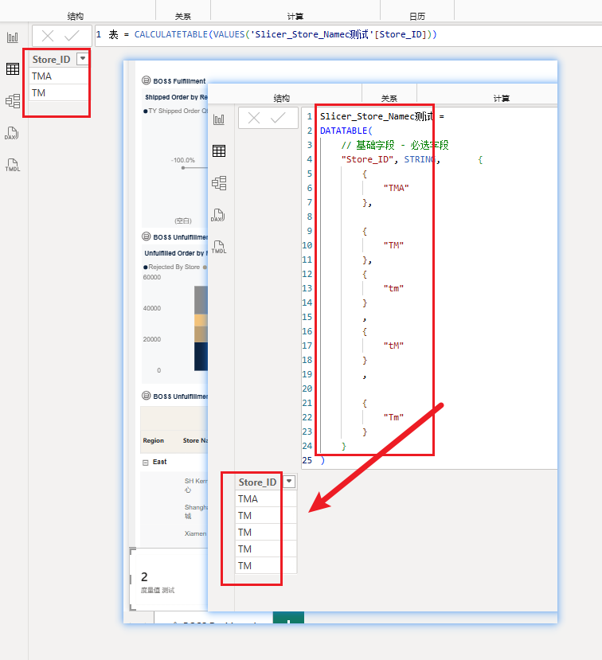

#  一、Power BI 底层引擎（DAX 引擎与 VertiPaq 存储引擎）工作原理的问题

## 1、去除矩阵/表格空白指标：
矩阵在检测到该行所有度量均为 BLANK() 时，通常会自动隐藏该行（包括层级行），需要所有指标都为 BLANK() 才会自动隐藏该行。
## 2、为什么我的矩阵行/列都有值，交叉点却死活不显示？加了个维度表就好了？
核心原因一：事实表的“稀疏性” vs 维度表的“完整性”
1. 直接拉事实表字段（稀疏数据） 事实表（Fact Table）记录的是“已经发生的事件”。

比如：在“2023年10月”这个筛选条件下，Brand A 和 Co_Brand B 从来没有同时出现过。
在事实表的物理存储中，根本不存在 [Brand A, Co_Brand B, 2023年10月] 这一行数据。
Power BI 矩阵的底层优化机制：当矩阵使用事实表字段作为行/列时，它会去事实表里找交叉点。如果发现物理行数为 0，引擎会认为 “这个交叉点在现实世界中不存在”。为了节省性能，它会直接跳过这个单元格的渲染，甚至不会去执行你写的 DAX 度量值（哪怕你写了 RETURN 1）。
2. 引入维度表（完整骨架） 维度表（Dimension Table）记录的是“所有可能的实体”。

维度表里有一张完整的 Brand 列表（A, B, C...）和一张完整的 Co_Brand 列表（A, B, C...）。
当你把维度表字段拖入矩阵时，矩阵的行和列是由维度表撑起来的。
即使事实表里没有 A 和 B 的组合，矩阵依然会画出 A 行和 B 列的交叉格，因为维度表告诉矩阵：“A 和 B 是存在的，你必须给我画出这个格子！”
有了这个“格子”（也就是 DAX 中的计算上下文），你的度量值才会被触发执行，你的 SVG 才有机会被渲染出来。
核心原因二：DAX 上下文的“存在性” (Context Existence)
在 DAX 中，有一个非常重要的概念：空白行 (Blank Row) 与 空值 (Blank Value) 的区别。

没有维度表时： 当筛选器导致事实表中没有 Brand=A, CoBrand=B 的记录时，这个交叉点的 DAX 筛选上下文是“空”的（Empty Context）。 在空上下文中，很多视觉对象的条件格式、SVG 渲染逻辑会被直接短路（Short-circuit）。引擎觉得：“既然没数据，我连算都不算了。”

有维度表时： 维度表和事实表之间建立了关系（Relationship）。 当矩阵处于 Dim_Brand[A] 和 Dim_Co_Brand[B] 的交叉点时，DAX 引擎会拿着 A 和 B 去事实表里找。 虽然没找到，但因为外部的维度上下文是真实存在的（A 和 B 在维度表里有物理行），DAX 引擎会返回一个 Blank Value（空值），而不是放弃计算。 关键点来了：只要 DAX 返回了值（哪怕是 Blank，或者被你强制转成的 0），Power BI 的条件格式和 SVG 渲染引擎就会被激活！

核心原因三：视觉对象的“自动隐藏空行/列”机制
Power BI 矩阵有一个默认行为：如果一行/一列的所有值都是 Blank，且行/列标题来自事实表，它倾向于把整行/整列折叠起来。

用事实表字段：因为事实表里没数据，矩阵认为这一行/列是“无意义的噪音”，直接隐藏。
用维度表字段：矩阵认为维度表里的成员是“业务上必须展示的实体”（比如就算某个品牌这个月没销量，你也可能想看到它是 0）。因此，矩阵会保留维度表的行/列标题，并把 Blank 值展示出来（或者交给你用 SVG 去填充）。
总结：一个生动的比喻
事实表 就像是 “考勤打卡记录”。如果员工张三今天没来，打卡机里就没有张三今天的记录。如果你直接按打卡记录画表格，张三今天这一格就是“彻底消失”的，连格子都没有。
维度表 就像是 “公司花名册”。不管张三今天来没来，花名册上都有张三的名字。
引入维度表的过程 就是：先拿出“花名册”画好表格的骨架（保证每个人都有格子），然后再去“打卡记录”里填数据。如果没打卡，就填个“-”（你的 SVG 灰色占位符）。
所以，为什么必须加维度表？ 因为 Power BI 的矩阵需要一张“花名册”来强行撑起表格的骨架（提供稳定的 DAX 上下文），只有这样，你精心编写的 DAX 逻辑和 SVG 代码才有“舞台”去执行和展示。 这是 Star Schema（星型模型）在 Power BI 中不可替代的核心价值之一。

# 二、Dax函数的区别

## 1、MAX 与 EARLIER 的区别：

a ：MAX ：筛选上下文 (Filter Context)、视觉对象的行/列维度、切片器、CALCULATE 的筛选参数、表格的每一行就是一个筛选上下文。
案例：度量值里不能用 EARLIER。度量值的求值环境是筛选上下文，不是行上下文，没有"外层行"可供 EARLIER 回溯。你的场景是度量值 + 表格视觉对象，所以只能用 MAX（或 SELECTEDVALUE、VALUES），不能用 啊、a、a ：EARLIER。MAX 在这里不是"求最大"，而是"单值提取器"。因为表格每一行把维度筛选成了单一值，MAX/MIN/SELECTEDVALUE 结果相同。
b ：SELECTEDVALUE(col)：上下文为单值时返回该值，多值时返回 BLANK（更安全，能暴露粒度错误）；
MAX(col)：多值时静默返回最大值（可能掩盖粒度问题）。
2、MAX ：行上下文 (Row Context)、计算列、迭代函数（SUMX、FILTER、ADDCOLUMNS…）逐行扫描时产生、迭代/逐行扫描时有行上下文。
案例：通常 EARLIER + CALCULATE 同框，因为 EARLIER 是行上下文，而 CALCULATE 是筛选上下文。

```dax
CumSalesInCat =                      // 计算列：类别内累计销售额
CALCULATE(                           // ← 外层：把行上下文转成筛选上下文并聚合
    SUM('Sales'[Amount]),
    FILTER(                          // ← 内层行上下文
        'Sales',
        'Sales'[Category] = EARLIER('Sales'[Category])
        && 'Sales'[Date]   <= EARLIER('Sales'[Date])
    )
)
```

## 2、DATATABLE vs UNION + ROW 对比

a ：DATATABLE：写什么就是什么，永远不变（除非你改代码）。
b ：UNION + ROW：每次数据刷新时重新计算，能"读到"其他表的最新值。
数仓汇率更新 → 刷新 Power BI → dim_t00_currency 表更新→ 计算表 Slicer_Currency_Selection 重新计算→ Currency_ExchangeRate 自动变为最新汇率 ✅

```dax
Slicer_Currency_Selection = 
// 功能：创建币种维度表，用于报表中的货币单位切换与汇率转换
// 用途：用户可通过此表选择以人民币或美元展示 KPI 金额类数据
//       数据源仅存储 RMB，选择 USD 时通过 Currency_ExchangeRate 进行汇率换算
// 参数表名称：Currency
// 遵循通用参数表模板规范
// 注意：USD 汇率动态取自数仓 dim_t00_currency 表，随数据刷新自动更新

VAR _ExchangeRate = 
    // 从数仓汇率表中获取 USD→CNY 最新有效汇率
    MAXX(
        FILTER(
            'dim_t00_currency',
            'dim_t00_currency'[source_currency_code] = "USD"       // 源币种：美元
                && 'dim_t00_currency'[target_currency_code] = "CNY" // 目标币种：人民币
                && 'dim_t00_currency'[is_valid] = 1                 // 仅取有效记录
        ),
        'dim_t00_currency'[exchange_rate]
    )

RETURN
UNION(
    // ==================== RMB - 人民币（基准币种，汇率 = 1，即原始值） ====================
    ROW(
        "Currency_ID",              "RMB",                              // 主键标识
        "Currency_Label",           "RMB",                              // 显示标签
        "Currency_Sort",            10,                                 // 排序顺序（起始10，步长10）
        "Currency_Description",     "人民币，中国境内业务默认结算货币",    // 详细描述
        "Currency_IsDefault",       TRUE,                               // 是否默认选中
        "Currency_IsActive",        TRUE,                               // 是否激活状态
        "Currency_Symbol",          "¥",                                // 货币符号
        "Currency_ExchangeRate",    1.0                                 // 汇率乘数：原始值不转换
    ),

    // ==================== USD - 美元（汇率动态取自数仓） ====================
    ROW(
        "Currency_ID",              "USD",                              // 主键标识
        "Currency_Label",           "USD",                              // 显示标签
        "Currency_Sort",            20,                                 // 排序顺序（起始10，步长10）
        "Currency_Description",     "美元，用于跨境业务或集团汇报口径",   // 详细描述
        "Currency_IsDefault",       FALSE,                              // 非默认选项
        "Currency_IsActive",        TRUE,                               // 是否激活状态
        "Currency_Symbol",          "$",                                // 货币符号
        "Currency_ExchangeRate",    _ExchangeRate                       // 汇率乘数：动态取自数仓，RMB ÷ 汇率 = USD
    )
)
```

# 三、网格

1、水平网格线： #E5E5E5，宽度：1px
2、垂直网格线： #E5E5E5，宽度：1px
3、列标头边框,边框位置下： #E5E5E5，宽度：1px
4、行标题边框，右框线： #E5E5E5，宽度：1px
5、"值"部分边框,边框位置下： #E5E5E5，宽度：1px

# 四、工具提示

仅限工具提示字段，加粗显示的值。
1、背景颜色： #1A1A1A，透明度：40%。
2、标签颜色、值颜色、钻取文本和图标颜色： #FFFFFF。

# 五、Dax注释种类

示例：

```dax
// 这是单行注释

/* 
   这是多行注释
   可以写很多行
*/

Sales Amount = 
    SUM(Sales[Amount])  // 行尾也可以加单行注释
```

# 六、配置数据源

## 本机：

### 内网

Driver={MySQL ODBC 9.6 Unicode Driver};Server=tenant-2104578120-cn-shanghai-bigdata.bytehouse.ivolces.com;Port=3306;Database=indep_rl_dim;Option=3;OPTION=8388608;

### 外网

Driver={MySQL ODBC 9.6 Unicode Driver};Server=bytehouse-hs-prod.cloud.bz;Port=33062;Database=indep_rl_dim;Option=3;OPTION=8388608;

## 开发机：

Driver={MySQL ODBC 9.7 Unicode Driver};Server=10.136.25.34;Port=9030;Database=dec2_gold;Option=3;

## M语言：

let
    源 = Odbc.Query(DBConnection, "#(lf)select * from `dec2_gold`.`t01_o2o_fulfillment_order_detail_d`#(lf)   "),
    更改的类型 = Table.TransformColumnTypes(源,{{"dt", type date}})
in
    更改的类型

## 新建参数：



## 注意：

需要网络设置，我们的bh没有开通公网访问，现在是通过网关服务器的方式进行连接的

# 七、全店新客数口径 & 不能合并的原因



## 三个原因

| #  | 原因                                   | 说明                                                                                                                                                                                                     |
| -- | -------------------------------------- | -------------------------------------------------------------------------------------------------------------------------------------------------------------------------------------------------------- |
| ① | **滚动窗口滑动，老客证据会消失** | `lp_12m_net_pay_amt` 是"截至该月往前 12 个月"的累计值。老客的历史消费会随时间滑出窗口，导致该字段归零。必须在 `start_period`（第一财月）这个基准时点锁定老客身份，扩大到整个 `period` 后证据丢失。 |
| ② | **两个步骤的区间语义不同**       | Step1 用`period`（找"本期有消费的人"），Step2 用 `start_period`（找"历史有消费的人"）。两者回答的是不同问题，不能混用同一个区间。                                                                    |
| ③ | **聚合粒度不同**                 | 两步法先按`user_id + shop_info_id` 聚合 `SUM(lp_12m_net_pay_amt)` 再判断 > 0；合并方案是行级判断 = 0，同一用户多行中部分行 = 0、部分行 > 0 时会误判。                                                |

---

## 反例（一句话版）

> 用户 A 在 2023-05 消费过 → 2024-01（start_period）时 `lp_12m = 200 > 0` → 是老客。
> 但到 2024-08 时，2023-05 已滑出 12 个月窗口 → `lp_12m = 0`。
> 合并方案在 2024-08 判断 `lp_12m = 0` → **误判为新客**。

---

## 结论

**`start_period` 是 `period` 的子集 ≠ 可以合并区间。**

子集关系只说明"时间包含"，但 `lp_12m_net_pay_amt` 的值随时间变化，必须在特定基准时点（第一财月）取值才能正确识别老客。

# 七、筛选器过滤矩阵行

```dax
ShowRow = 
VAR SelectedPlatform = 
    SELECTEDVALUE('Slicer_Platform_Selection'[Platform_ID], "ALL")
VAR RowHasData = 
    CALCULATE(
        COUNTROWS('a05_e2e_paid_media_product_data_d'),
        'a05_e2e_paid_media_product_data_d'[platform] = SelectedPlatform
    )
RETURN
    IF(
        SelectedPlatform = "ALL",
        1,                          -- ALL 时显示所有行
        IF(RowHasData > 0, 1, 0)   -- 非ALL时，只显示有数据的行
    )

```

# 八、Dax 和 SQL差异：

## 字母大小写

1、VALUES / DISTINCTCOUNT / SUMMARIZE：不区分大小写，ABD 和 abd 算一个值 → 一行
2、解决方案：
MD5 是字节级哈希："abc" 和 "ABC" 的字节不同 → 哈希值完全不同 → 进 PBI 模型的是两个不同的哈希串，引擎的"不区分大小写"规则作用在哈希串上，而这两个哈希串并不互为大小写变体，所以不会被合并。

"abc"  → 900150983cd24fb0d6963f7d28e17f72
"ABC"  → 30f74c9c4d2f4a2e0e1e3f3f3f3f3f3f   （示例值）
         ↑ 两个完全不同的串，PBI 视为两个值 ✅
等于把大小写差异"冻结"成了哈希值差异，绕开了模型排序规则。



# 九、 嵌套 IF 返回表时 DAX 引擎会把表达式降级为标量值，导致错误结果

来源：KPIs Overview_Target_ms.md

## 1、platform为单选的情况，其中有特殊值"ALL",表示全选，布尔表达式：

```dax
VAR __ChannelID = SELECTEDVALUE(Slicer_Platform_Selection[Platform_ID], "ALL")
VAR __IsAllPlatform = (__ChannelID = "ALL")

(a05_e2e_paid_media_summary_d[platform] = __ChannelID
    || ( __IsAllPlatform && a05_e2e_paid_media_summary_d[platform] IN { "TM", "JD" } ))
```

## 2、platform为单选的情况，ALL→IN；单平台→=__ChannelID，使用FILTER(ALL) 变量（表筛选器），返回表：

```dax
VAR __ChannelID = SELECTEDVALUE(Slicer_Platform_Selection[Platform_ID], "ALL")
VAR __IsAllPlatform = (__ChannelID = "ALL")

VAR __PlatformFilter =
        FILTER(
            ALL(a05_e2e_paid_media_fcst_data_m[platform]),
            // 如果 __ChannelID = "ALL"，返回 IN {"TM", "JD"}，否则返回 = __ChannelID
            IF(
                __ChannelID = "ALL",
                a05_e2e_paid_media_fcst_data_m[platform] IN {"TM", "JD"},
                a05_e2e_paid_media_fcst_data_m[platform] = __ChannelID
            )
        )
```


# 十、分组去重模式
## 计算链路：
第一层去重：SUMMARIZE + "_MaxPush" + FILTER
第二层去重：最终 SUMMARIZE(..., [order_code])

__FilteredTable   ← FILTER(表, dt ∈ 时间范围 + SWITCH Calc_Type)
__LatestTable     ← SELECTCOLUMNS(
                      FILTER(
                        SUMMARIZE(..., "_MaxPush", CALCULATE(MAX(push_time))),
                        push_time = _MaxPush          ← 每组只留最新一条
                      ),
                      "order_code", "failure_remark"  ← 投影
                    )
__Result          ← COUNTROWS(
                      SUMMARIZE(
                        FILTER(__LatestTable, failure_remark IN {...}),
                        [order_code]

# 十一、ALLSELECTED
通用结论（值得记住的模式）
凡行/列维度表的分组列配置了 Sort by Column，占比类分母的 ALLSELECTED 就必须用整表参数（或显式同时覆盖排序列），单列参数会被排序列残留筛选架空。 DIM_Row_VIC_Tier 的 Indicator Order、BOSS Dashboard 各 Dim_ColMetric 的排序列都是同类场景。

单列版：  移除 RowLabel 筛选 ──✕  Order=10 残留 ──► DIM 仅剩 T1 ──► 分母 = T1 人数（no-op）
整表版：  移除全表行筛选 ──────► DIM 全 5 行 ─────► 分母 = T1+…+T5